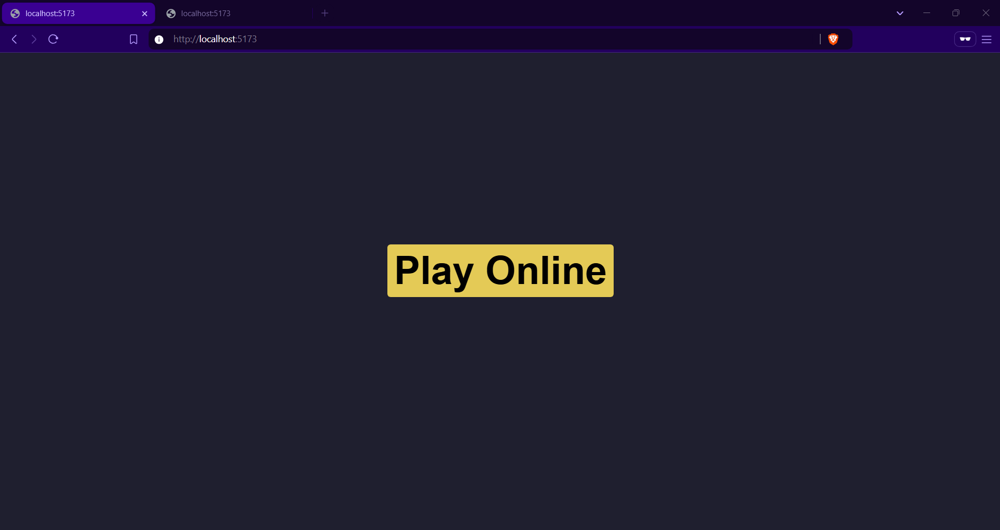
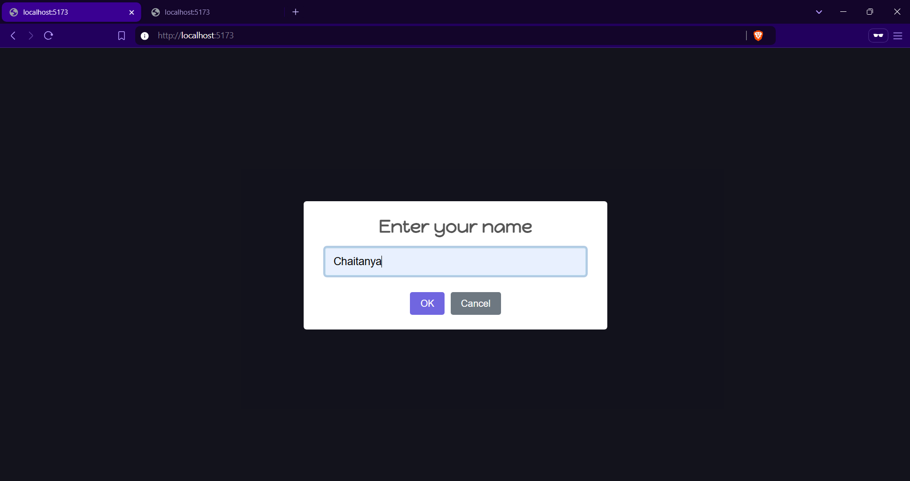
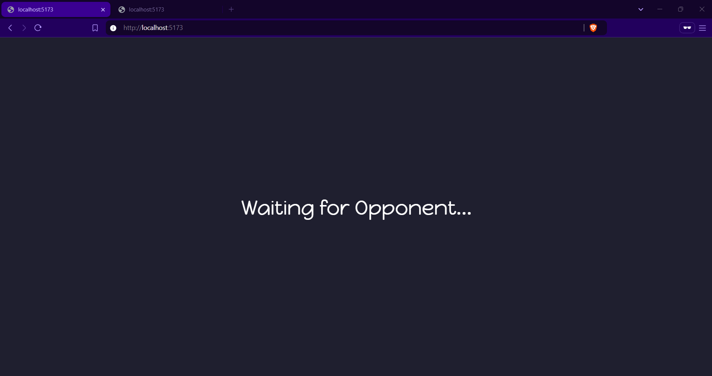
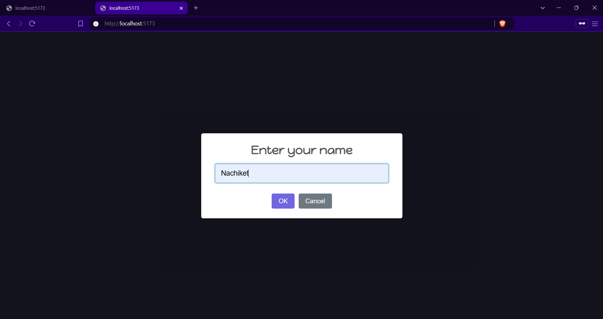
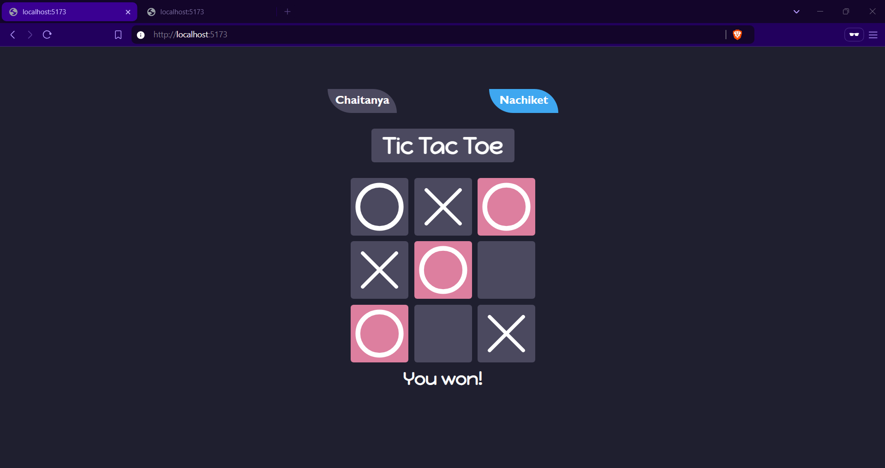
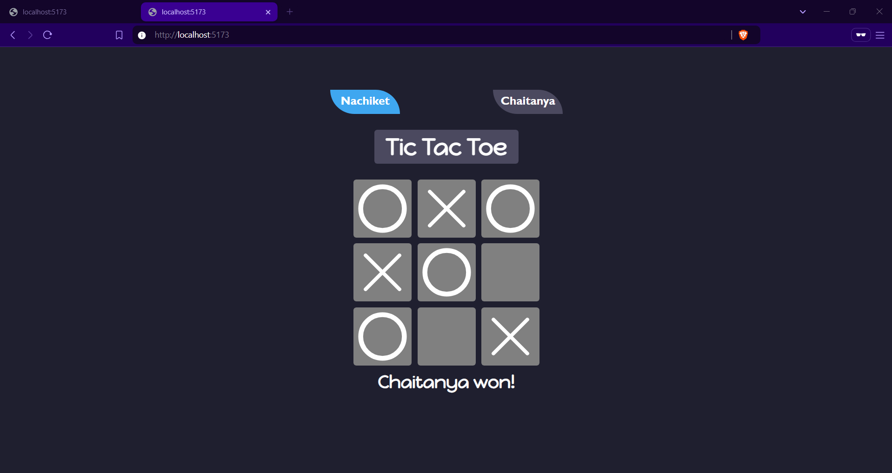

# Online Multiplayer Tic Tac Toe

An interactive multiplayer Tic Tac Toe game built using **React.js** and **Socket.io** for real-time gameplay. The project offers seamless online matchmaking, dynamic winner detection, and robust state management to ensure an engaging user experience.

---

## Features

- **Real-time Gameplay**: Play live matches with opponents using **Socket.io**.
- **Online Matchmaking**: Automatically find opponents or wait for a match to begin.
- **Dynamic Winner Detection**: Automatically determines the winner or detects a draw.
- **Robust State Management**: Efficiently handles game reconnections and opponent disconnections using **React hooks**.
- **Real-time Synchronization**: Ensures the game state remains consistent between players.

---

## Tech Stack

- **Frontend**: React.js
- **Backend**: Node.js with Socket.io
- **Styling**: CSS
- **State Management**: React hooks

---

## Installation

1. Clone the repository:
   ```bash
   git clone https://github.com/chaitanyagalande/TicTacToe_Multiplayer
   cd TicTacToe_Multiplayer

2. Start the development server inside client:
   ```bash
   npm run dev

3. Start the backend server inside server (in another terminal):
   ```bash
   npm start

4. Open the app in your browser:
   http://localhost:5173

## Usage
1. Open the app and either wait for an opponent or start a game immediately.
2. Play Tic Tac Toe in real-time with another player.
3. View the game result (win, lose, or draw) after the match ends.
4. If a player disconnects, the game state handles it gracefully.

## Screenshots








## License
This project is licensed under the MIT License.

## Contributing
Contributions are welcome! Feel free to fork the repository and submit a pull request.

## Contact
For any queries, contact me via chaitanya051203@gmail.com.
